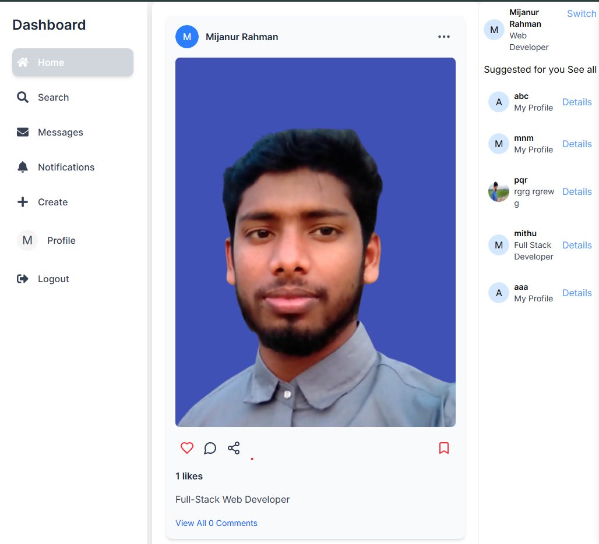
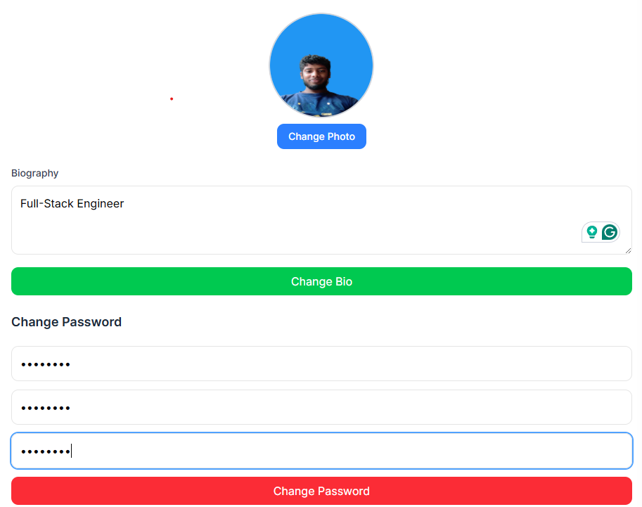

# Social Media App

A **full-stack social media application** built with **Next.js 15** and **TypeScript**, featuring user authentication, post interactions, and more.





## 🚀 Features

### 🔐 User Authentication

-   **Signup & Login**
-   **OTP Verification**
-   **Edit Profile**
-   **Reset Password**

### 📢 Post Management

-   **Create Post**
-   **Like / Unlike Post**
-   **Save / Unsave Post**
-   **Share Post**
-   **View Post User Info**
-   **Delete Post**
-   **Follow / Unfollow Users**

### 👤 User Information

-   **View User's Post Like / Unlike Count**
-   **View Saved / Unsaved Posts Count**

### 🛡️ Access Control

-   **Only authenticated users can view all posts**
-   **Users can delete only their own posts**

---

## 🛠️ Tech Stack

| Technology        | Description                      |
| ----------------- | -------------------------------- |
| **Next.js 15**    | React-based full-stack framework |
| **TypeScript**    | Strict type safety               |
| **ShadCN UI**     | UI components for design         |
| **Tailwind CSS**  | Utility-first CSS framework      |
| **Redux Toolkit** | State management                 |
| **MongoDB**       | NoSQL database                   |

---

## 🔥 API Endpoints

### Auth Routes

-   `POST /api/auth/signup` – Register new user
-   `POST /api/auth/login` – User login
-   `POST /api/auth/otp-verify` – OTP verification
-   `POST /api/auth/reset-password` – Reset user password

### Post Routes

-   `POST /api/posts/create` – Create a new post
-   `POST /api/posts/like` – Like or unlike a post
-   `POST /api/posts/save` – Save or unsave a post
-   `DELETE /api/posts/:id` – Delete own post
-   `GET /api/posts` – Get all posts (authenticated users only)

### User Routes

-   `GET /api/users/:id` – Get user profile
-   `POST /api/users/follow` – Follow or unfollow a user

---

## 🏗️ Project Structure

```
/social-media-app
├── /components  # UI components (ShadCN UI)
├── /pages       # Next.js pages (routes)
├── /redux       # Redux Toolkit setup
├── /lib         # Helper functions & API calls
├── /models      # MongoDB models (Mongoose)
├── /styles      # TailwindCSS styles
└── /utils       # Utility functions
```

---

## 👨‍💻 Contributing

1. Fork the repository
2. Create a new branch: `git checkout -b feature-name`
3. Commit your changes: `git commit -m 'Add new feature'`
4. Push to the branch: `git push origin feature-name`
5. Open a Pull Request

---
